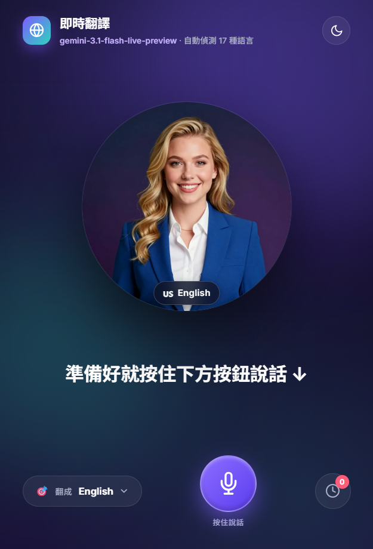
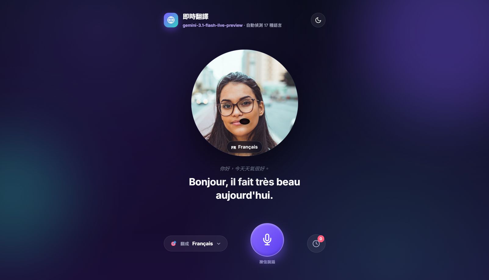
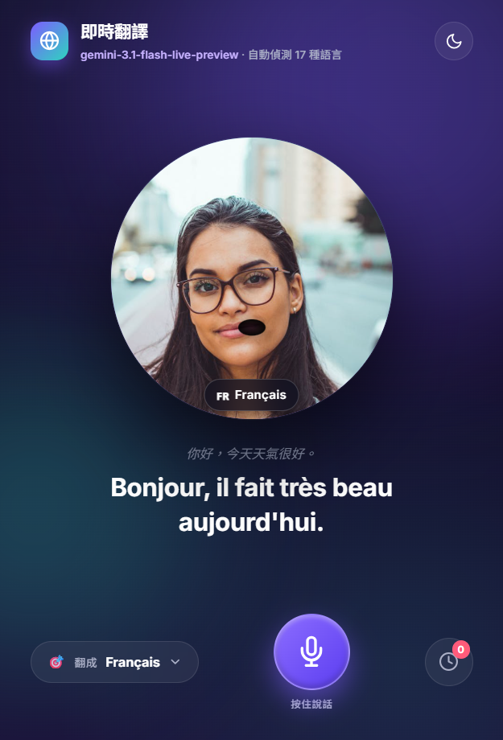

# 即時翻譯 · Avatar Live

> 按住說話、鬆開翻譯。由 **Gemini 3.1 Flash Live** 驅動的低延遲多國語言翻譯 chatbot，配上 17 位真人 Avatar 與口型同步。



## ✨ 特色

| 功能 | 說明 |
|---|---|
| 🎙️ **Push-to-Talk** | 按住按鈕（或空白鍵）說話，放開即翻譯 |
| 🌐 **17 種語言** | 自動偵測來源 → 翻成繁中 / 英 / 日 / 韓 / 西 / 法 / 德 / 義 / 葡 / 俄 / 越 / 泰 / 印 / 阿 / 印地 / 簡中 |
| 👤 **真人 Avatar** | 每種語言對應一位代表性形象，切換時平滑過渡 |
| 💋 **口型同步** | 譯文播放時，Avatar 嘴部隨音量即時開合 |
| 🔊 **真語音回放** | Gemini 直接以目標語言發聲，TTS 品質遠勝瀏覽器內建 |
| 📝 **即時逐字稿** | 同時顯示原文與譯文（input + output transcription） |
| 🌓 **暗 / 亮主題** | 自動記憶偏好 |
| 📜 **歷史紀錄** | 每段翻譯都保留可複製、可重播 |
| ♿ **無障礙** | Lighthouse Accessibility / Best Practices / SEO 全 100 分 |

## 🏗️ 架構

```
┌─ Browser ──────────────────────────┐
│ AudioWorklet → 16kHz PCM Int16     │     Socket.IO/WSS
│ AvatarController + lip-sync         │ ◄────────────────► Flask + Flask-SocketIO
│ Translation card / history modal    │                    (threading mode)
└─────────────────────────────────────┘                              │
                                                                     │ asyncio bridge
                                                                     │ (per-sid thread + loop)
                                                                     ▼
                                                        Gemini Live API (WSS)
                                                        BidiGenerateContent
                                                        ├ manual VAD
                                                        ├ AUDIO modality
                                                        ├ input + output transcription
                                                        └ system_instruction (auto-detect)
```

完整藍圖：[`docs/blueprint.mmd`](docs/blueprint.mmd) · 架構決策：[`docs/ADR-001-live-api-bridge.md`](docs/ADR-001-live-api-bridge.md)

## 🚀 快速開始

### 前置需求
- Python 3.12+
- Google AI Studio API key（[免費申請](https://aistudio.google.com/apikey)）

### 安裝
```bash
pip install -r requirements.txt
cp .env.example .env
# 編輯 .env，填入 GEMINI_API_KEY
python run.py
```

打開瀏覽器到 http://127.0.0.1:5000 即可。

### 環境變數
| 變數 | 預設值 | 說明 |
|---|---|---|
| `GEMINI_API_KEY` | _(必填)_ | Google AI Studio 金鑰 |
| `GEMINI_MODEL` | `gemini-3.1-flash-live-preview` | Live API 模型 |
| `FLASK_SECRET` | `dev-secret` | Flask session secret |
| `HOST` / `PORT` | `127.0.0.1` / `5000` | 伺服器綁定 |

## 🧪 端到端測試

```bash
python scripts/smoke_test.py        # 單輪 zh-TW → en（用 SAPI 合成中文語音）
python scripts/smoke_test_multi.py  # 多輪 zh-TW → ja / ko / fr 切換
```

預期輸出：
```
[transcript] '你好,今天天氣很好。'
[translation] 'Hello, the weather is very nice today.'
[turn_complete] {translation: '...', transcript: '...'}
DONE turn={...}, audio_bytes=125770
```

## 📁 專案結構

```
.
├── app/
│   ├── __init__.py          # Flask app factory
│   ├── live_bridge.py       # 核心橋接層（asyncio + Live API）
│   ├── session.py           # SessionManager 生命週期管理
│   ├── sockets.py           # Socket.IO 事件入口
│   ├── handlers/
│   │   ├── ptt_handler.py   # PTT 事件處理
│   │   └── lang_handler.py  # 連線 / 語言切換
│   └── languages.py         # 17 種語言清單
├── static/
│   ├── avatars/             # 17 張代表性 Avatar
│   ├── css/styles.css       # 玻璃擬態 + 動效
│   └── js/
│       ├── app.js           # 主程式
│       ├── pcm-worklet.js   # 48k → 16k PCM 即時降採樣
│       └── lib/
│           ├── avatar-sync.js   # Avatar 切換 + 口型同步
│           ├── audio-context.js # 麥克風 / AnalyserNode
│           ├── socket-client.js # Socket.IO wrapper
│           └── translation-card.js # 譯文泡泡與歷史
├── templates/index.html
├── docs/                    # 藍圖、ADR、審查報告
├── scripts/                 # 測試 / 探測工具
├── requirements.txt
├── run.py                   # 啟動入口
└── .env.example
```

## 🎨 截圖

| 主畫面（行動） | 桌機 | 翻譯中 |
|---|---|---|
|  |  |  |

## 🛡️ 安全與隱私

- 金鑰透過 `.env` + `python-dotenv` 載入，`.gitignore` 已排除
- `static/avatars/` 真人照片來源：HuggingFace Z-Image-Turbo 生成 + Pexels 公開圖庫精選（[Pexels License](https://www.pexels.com/license/)，可商用、無需署名）
- 音訊資料只在記憶體流動，不寫盤、不轉發第三方

## 🐛 已知限制

- Werkzeug dev server 在 Socket.IO disconnect 後偶有 500 ping log（無功能影響）；上線改用 gunicorn / uvicorn
- AudioWorklet 與 `getUserMedia` 需 HTTPS 或 `localhost`
- Live API 模型 `gemini-3.1-flash-live-preview` 是 audio-to-audio 設計，不支援純 TEXT modality（已用 AUDIO + output_transcription 解決）

## 🛠️ 重點技術選型

| 領域 | 選擇 | 為何 |
|---|---|---|
| 後端 async 模式 | Flask-SocketIO threading + per-sid asyncio loop | 與 google-genai async client 完全相容；避免 eventlet/grpc 衝突 |
| Live API VAD | manual（disabled） | PTT 場景不依賴自動 VAD，由前端 ptt_start/ptt_end 控制 |
| 前端音訊 | AudioWorklet + 線性插值降採樣 | 原生 MediaRecorder 給壓縮格式，不可用 |
| 口型同步 | AnalyserNode RMS → SVG `scaleY` | 簡潔、效能高、不需 ML |

## 📜 License

MIT
